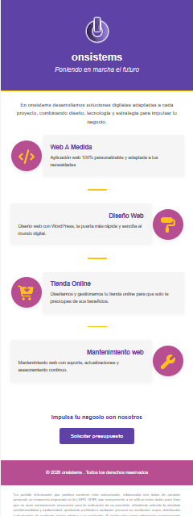

#  📩 Sistema de plantilla HTML para Email Corporativo

## 📌 Introducción

El presente proyecto consiste en el desarrollo de una plantilla profesional en formato HTML diseñada específicamente para su uso en campañas de email marketing y comunicación corporativa.

La plantilla permite presentar los servicios de Onsistems de forma estructurada, visualmente atractiva y totalmente compatible con los principales clientes de correo electrónico.

El diseño está optimizado mediante el uso de tablas y estilos en línea, garantizando así una correcta visualización en clientes como Gmail y en entornos reales de envío mediante servicios de correo empresarial como Arsys.

Tiene como finalidad mejorar la comunicación empresarial, reforzar la identidad de marca y aumentar la conversión mediante una llamada a la acción clara y estratégica.


## 🎯 Objetivos del Proyecto

* Diseñar una plantilla HTML optimizada para el correo electrónico.
* Garantizar compatibilidad con múltiples clientes de email.
* Aplicar buenas prácticas de maquetación para email marketing.
* Presentar servicios empresariales de forma clara y profesional.
* Incluir una llamada a la acción (CTA) efectiva.
* Mantener coherencia con la identidad visual corporativa.

## 🔄 Flujo de Funcionamiento

1. Se estructura el contenido mediante HTML5.
2. Se aplican estilos en línea para asegurar compatibilidad.
3. Se organiza la maquetación mediante tablas.
4. La plantilla puede integrarse en sistemas SMTP.
5. El correo es enviado al destinatario mostrando el diseño correctamente renderizado.

## 🖼️ Estructura Visual del Folleto

La plantilla está compuesta por las siguientes secciones:

* Cabecera corporativa con logo y eslogan.
* Sección introductoria informativa.
* Bloques de servicios destacados.
* Separadores visuales.
* Botón de llamada a la acción.
* Pie de página legal y corporativo.



## 🧱 Arquitectura Técnica del Documento

### 1️⃣ Documento Base 
```html
<!DOCTYPE html>
<html lang="es">
```

* Define el documento bajo el estándar HTML5.
* Se especifica el idioma español para mejorar la accesibilidad y semántica.

### 2️⃣ Contenedor Principal

Se utiliza una tabla principal al 100% del ancho de pantalla:

```html
<table width="100%">
```

Funciones:
* Actuar como fondo general del email.
* Permitir el centrado del contenido.
* Garantizar compatibilidad con clientes de correo restrictivos.

En el desarrollo de emails profesionales, el uso de tablas es obligatorio debido a las limitaciones de renderizado que pueden presentar distintos gestores de correo.


### 3️⃣ Contenedor Central (600px)

```html
<table width="600">
```
* Ancho estándar en email marketing.
* Mejora la legibilidad.
* Mantiene coherencia en diferentes resoluciones.
* Centrado dentro del contenedor principal.

### 4️⃣ Cabecera Corporativa

Incluye:
* Logotipo de Onsistems
* Nombre comercial.
* Eslogan corporativo.
* Fondo de color corporativo.
* Línea inferior corporativa.

### 5️⃣ Sección de Introducción

Bloque de texto explicativo que:

* Resume los servicios ofrecidos.
* Comunica la propuesta de valor.
* Mantiene tono corporativo y formal.

Se aplican propiedades como:

* `line-height` para mejorar la lectura.
* Colores neutros para elegancia visual.
* Espaciado interno mediante padding.

### 6️⃣ Bloques de Servicios

Cada servicio está estructurado mediante una tabla interna que contiene:

* Icono representativo dentro de un contenedor circular.
* Caja de contenido con fondo gris claro.
* Título destacado en color corporativo.
* Descripción breve y clara.

Servicios incluidos:

* Web a Medida 
* Diseño Web 
* Tienda Online.
* Mantenimiento Web.

Características técnicas aplicadas:

* `border-radius` para diseño moderno.
* `box-shadow` para profundidad visual.
*  Alternancia izquierda/derecha para dinamismo.
*  Separadores visuales entre bloques.

### 7️⃣ Separadores Visuales

Se utilizan pequeñas barras decorativas en color corporativo que:

* Separan visualmente los bloques.
* Mejoran la jerarquía del contenido.
* Refuerzan coherencia estética.

### 8️⃣ CTA

Botón principal del folleto:

```html
<a href="https://onsistems.com/contacto/" target="_blank" rel="noopener noreferrer">
    Solicitar presupuesto
</a>
```
Características:

* Fondo corporativo.
* Texto de contraste.
* Bordes redondeados.
* Padding amplio para mejor interacción.
* Apertura en nueva pestaña.
* Uso de `rel="noopener noreferrer"` por seguridad.

Su función principal es generar conversión y redirigir tráfico hacia la página de contacto.

### 9️⃣ Footer Corporativo y Legal

Incluye:

* Derechos reservados. 
* Aviso legal conforme a normativa de protección de datos.
* Texto informativo en tamaño reducido. 
* Fondo corporativo diferenciado.

Importancia:

* Cumplimiento legal.
* Protección jurídica.
* Imagen empresarial responsable.

## 🔗 Tecnologías Utilizadas

**HTML5** → Estructura del documento.
**CSS Inline** → Estilos aplicados directamente en cada etiqueta.
**Tablas HTML** → Maquetación compatible con clientes de correo.
**Imágenes externas optimizadas** → Recursos gráficos corporativos.


## 📂 Estructura del proyecto

| Archivo | Función |
|----------|----------|
| index.html | Plantilla completa del folleto en formato email |
| README.md| Documentación técnica del proyecto |

## 📧 Compatibilidad

Plantilla optimizada para:

* Gmail.
* Cuentas de correo empresarial gestionadas mediante Arsys (envío SMTP).

La plantilla ha sido verificada en entornos reales de envío mediante SMTP con Arsys.

## 🔒 Buenas Prácticas Implementadas

* Uso exclusivo de estilos inline.
* Maquetación basada en tablas.
* Ancho fijo estándar (600px).
* Jerarquía visual clara.
* Uso de enlaces seguros.
* Estructura limpia y mantenible.


## 👨‍💻 Autor

Noelia Parra Rodríguez  

Proyecto desarrollado con fines formativos y aplicación profesional.
